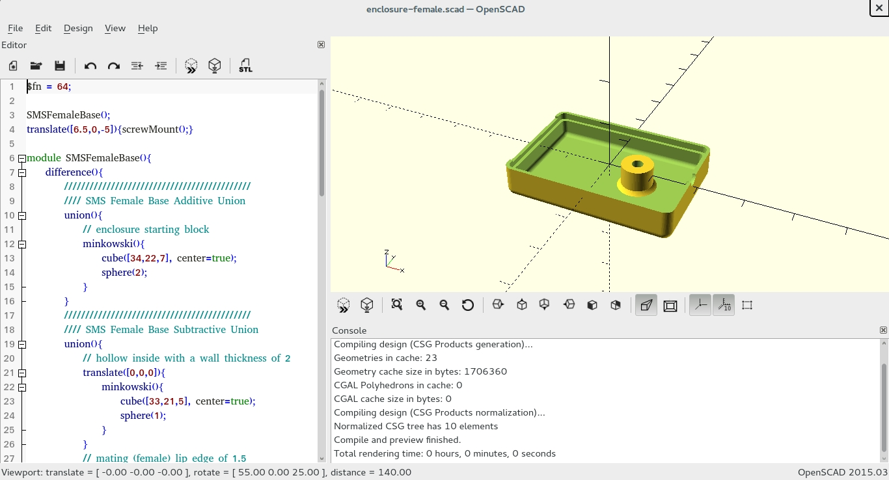

# capacitive-moisture-sensor-enclosure
OpenSCAD Models of Male|Female Enclosure Pieces for a Capacitive Moisture Sensor

##### Download Source Files
$ curl -LO https://github.com/alexhla/capacitive-moisture-sensor-enclosure/archive/master.zip
##### Unzip
$ unzip master.zip
##### Navigate to Project
$ cd capacitive-moisture-sensor-enclosure-master
##### Open with OpenSCAD
$ openscad enclosure-female.scad
$ openscad enclosure-male.scad

	
	

